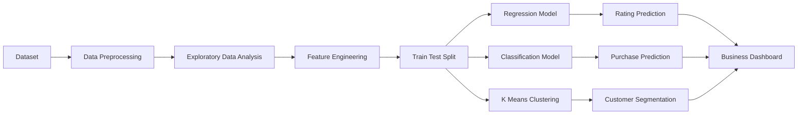
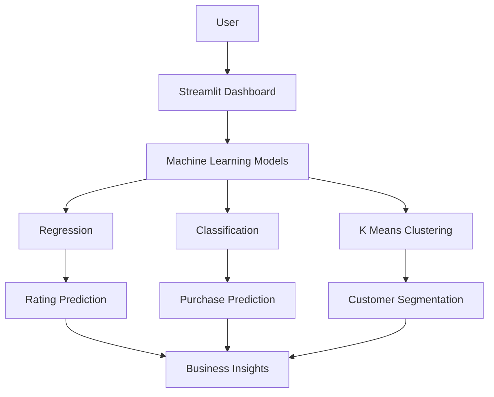

# E-Commerce Recommendation System

## Overview

The E-Commerce Recommendation System is a Machine Learning application designed to analyze customer purchasing behaviour and provide intelligent business insights.

The project implements multiple Machine Learning techniques including Regression, Classification, and Clustering to predict customer ratings, estimate purchase likelihood, and segment customers based on shopping behaviour. An interactive Streamlit dashboard is also developed for visualization and prediction.

---

# Features

- Product Rating Prediction
- Purchase Prediction
- Customer Segmentation
- Exploratory Data Analysis
- Interactive Streamlit Dashboard
- Business Insights
- Model Comparison
- Saved Machine Learning Models

---

# Technologies Used

| Technology | Purpose |
|------------|----------|
| Python | Programming Language |
| Pandas | Data Analysis |
| NumPy | Numerical Computing |
| Matplotlib | Visualization |
| Scikit-Learn | Machine Learning |
| Streamlit | Dashboard |
| Joblib | Model Serialization |

---

# Project Structure

```
Ecommerce_Recommendation_System
│
├── app.py
├── requirements.txt
├── README.md
├── Business_Report.md
├── online_shoppers_intention.csv
│
├── notebook
│   └── ecommerce_recommendation_system.ipynb
│
├── models
│   ├── rating_model.pkl
│   ├── purchase_model.pkl
│   ├── clustering_model.pkl
│   └── scaler.pkl
│
├── screenshots
│   ├── 01_purchase_distribution.png
│   ├── 02_rating_distribution.png
│   ├── 03_customer_age.png
│   ├── 04_gender_distribution.png
│   ├── 05_product_category.png
│   ├── 06_average_spending.png
│   ├── 07_browsing_time.png
│   ├── 08_previous_purchase.png
│   ├── 09_correlation_matrix.png
│   ├── 10_top_customers.png
│   ├── 11_purchase_vs_browsing.png
│   ├── 12_actual_prediction.png
│   ├── 13_confusion_matrix.png
│   ├── 14_roc_curve.png
│   ├── 15_elbow_method.png
│   ├── 16_customer_segments.png
│   ├── 17_customer_segment_bar.png
│   └── 18_silhouette_analysis.png
│
└── assets
```

---

# System Workflow



---

# System Architecture



---

# Machine Learning Models

## Regression

Objective

Predict customer product ratings.

Algorithms

- Linear Regression
- Ridge Regression

Evaluation Metrics

- Mean Absolute Error
- Mean Squared Error
- Root Mean Squared Error
- R² Score

---

## Classification

Objective

Predict whether a customer is likely to purchase a product.

Algorithm

- Logistic Regression

Evaluation Metrics

- Accuracy
- Precision
- Recall
- Confusion Matrix
- ROC Curve

---

## Clustering

Objective

Segment customers into different behavioural groups.

Algorithm

- K-Means Clustering

Evaluation

- Elbow Method
- Silhouette Score

---

# Exploratory Data Analysis

The project includes the following visualizations.

- Purchase Status Distribution
- Rating Distribution
- Customer Age Distribution
- Gender Distribution
- Product Category Distribution
- Average Spending by Category
- Browsing Time Distribution
- Previous Purchases Distribution
- Correlation Matrix
- Top Customers by Spending
- Purchase vs Browsing Time
- Customer Segmentation

---

# Dashboard Modules

The Streamlit application contains the following modules.

- Dashboard
- Rating Prediction
- Purchase Prediction
- Customer Segmentation
- Model Comparison
- Business Recommendation

---

# Results

The developed system successfully demonstrates

- Product rating prediction
- Purchase prediction
- Customer segmentation
- Interactive dashboard visualization
- Business decision support
- Machine Learning model comparison

---

# Installation

Clone the repository

```bash
git clone https://github.com/your-username/Ecommerce_Recommendation_System.git
```

Move into the project directory

```bash
cd Ecommerce_Recommendation_System
```

Install required libraries

```bash
pip install -r requirements.txt
```

Run the Streamlit application

```bash
streamlit run app.py
```
---

# Future Scope

The project can be further enhanced by implementing

- Collaborative Filtering
- Content-Based Recommendation
- Hybrid Recommendation Systems
- Deep Learning Models
- Real-Time Recommendation Engine
- Cloud Deployment
- REST API Integration
- Sales Forecasting

---

# Author

**Ravneet Kaur**

---

# License

This project is developed for educational purposes as part of the Open Data Intelligence Hub program.
