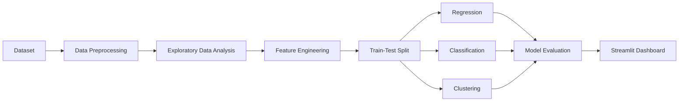

# E-Commerce Recommendation System

## Overview

The E-Commerce Recommendation System is a Machine Learning application developed to analyze customer purchasing behaviour and generate business insights. The project combines regression, classification, and clustering techniques to predict customer ratings, estimate purchase likelihood, and segment customers based on shopping behaviour.

The application also includes an interactive Streamlit dashboard for visualization and prediction.

---

## Project Objectives

- Predict customer product ratings using regression.
- Predict purchase likelihood using classification.
- Segment customers using K-Means clustering.
- Visualize customer behaviour through an interactive dashboard.
- Compare Machine Learning models.

---

## Technologies Used

| Technology | Purpose |
|------------|----------|
| Python | Programming Language |
| Pandas | Data Processing |
| NumPy | Numerical Computing |
| Matplotlib | Data Visualization |
| Scikit-Learn | Machine Learning |
| Streamlit | Dashboard Development |
| Joblib | Model Serialization |

---

## Project Structure

```
Ecommerce_Recommendation_System
│
├── app.py
├── requirements.txt
├── README.md
├── Business_Report.md
├── online_shoppers_intention.csv
│
├── notebook
│   └── ecommerce_recommendation_system.ipynb
│
├── models
│   ├── rating_model.pkl
│   ├── purchase_model.pkl
│   ├── clustering_model.pkl
│   └── scaler.pkl
│
├── screenshots
│   ├── dashboard.png
│   ├── rating_prediction.png
│   ├── purchase_prediction.png
│   ├── customer_segmentation.png
│   └── model_comparison.png
│
└── assets
```

---

# System Workflow



---

# System Architecture

```mermaid
flowchart TD

User

-->

Dashboard

Dashboard

-->

Machine Learning Models

Machine Learning Models

-->

Regression Model

Machine Learning Models

-->

Classification Model

Machine Learning Models

-->

K-Means Clustering

Regression Model

-->

Rating Prediction

Classification Model

-->

Purchase Prediction

K-Means Clustering

-->

Customer Segmentation

Rating Prediction

-->

Dashboard

Purchase Prediction

-->

Dashboard

Customer Segmentation

-->

Dashboard
```

---

# Machine Learning Models

## Regression

Purpose

Predict customer product ratings.

Algorithms

- Linear Regression
- Ridge Regression

Evaluation Metrics

- Mean Absolute Error (MAE)
- Mean Squared Error (MSE)
- Root Mean Squared Error (RMSE)
- R² Score

---

## Classification

Purpose

Predict whether a customer is likely to purchase a product.

Algorithm

- Logistic Regression

Evaluation Metrics

- Accuracy
- Precision
- Recall
- Confusion Matrix
- ROC Curve

---

## Clustering

Purpose

Segment customers according to shopping behaviour.

Algorithm

- K-Means Clustering

Evaluation Metrics

- Elbow Method
- Silhouette Score

---

# Exploratory Data Analysis

The project includes the following analyses:

- Purchase Status Distribution
- Rating Distribution
- Customer Age Distribution
- Gender Distribution
- Product Category Distribution
- Average Spending by Category
- Browsing Time Distribution
- Previous Purchases Distribution
- Correlation Matrix
- Top Customers by Spending
- Purchase vs Browsing Time
- Customer Segmentation

---

# Dashboard Features

The Streamlit dashboard provides:

- Dataset Preview
- Rating Prediction
- Purchase Prediction
- Customer Segmentation
- Model Comparison
- Business Recommendation
- Interactive Data Visualization

---

# Screenshots

## Dashboard


---

## Rating Prediction


---

## Purchase Prediction


---

## Customer Segmentation


---

## Model Comparison


---

# Installation

Clone the repository

```bash
git clone https://github.com/your-username/Ecommerce_Recommendation_System.git
```

Navigate to the project directory

```bash
cd Ecommerce_Recommendation_System
```

Install dependencies

```bash
pip install -r requirements.txt
```

Run the application

```bash
streamlit run app.py
```

---

# Results

The developed system successfully:

- Predicts customer ratings.
- Predicts purchase likelihood.
- Segments customers into meaningful groups.
- Provides interactive business insights.
- Visualizes customer behaviour using multiple analytical techniques.

---

# Future Enhancements

- Deep Learning Recommendation Models
- Collaborative Filtering
- Content-Based Recommendation
- Real-Time Recommendation Engine
- Cloud Deployment
- User Authentication
- Sales Forecasting
- REST API Integration

---

# Author

**Japneet Kaur**

Task 6 – Building a Recommendation System for E-Commerce

Open Data Intelligence Hub
